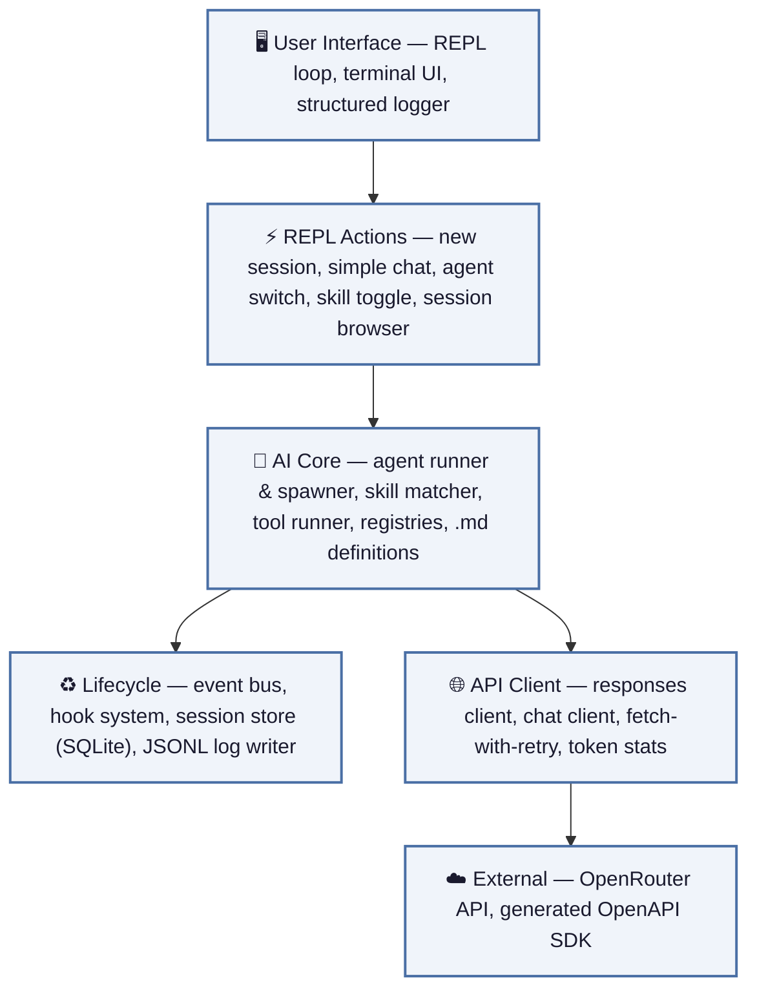

# Harmless

Minimal AI harness built to showcase and experiment with core AI tooling functionalities.

## Getting Started

### Prerequisites

- [Bun](https://bun.sh/) runtime (v1.0+)
- An [OpenRouter](https://openrouter.ai/) API key

### Setup

1. **Clone and install**

```bash
git clone <repo-url> && cd harmless
bun install
```

2. **Configure environment** — copy `.env` and fill in your values:

```env
PORT=3000
OPENROUTER_API_KEY=<your openrouter api key>
FS_ROOTS=./mount
VISION_MODEL=google/gemini-3-flash-preview
WEB_SEARCH_MODEL=openai/gpt-4o-mini
DEFAULT_MODEL=nvidia/nemotron-3-ultra-550b-a55b:free
COMPACTION_WINDOW_SIZE=20
MAX_COMPACTED_TEXT_PER_TURN=500
```

All of the variables can be customize. Port value, model names and FS_ROOTS value is provided as an example.

Please be aware that OpenRouter usage with given models will result in paid service and you will be billed by OpenRouter. For more information, please visit https://openrouter.ai/pricing.

2. **Run the app**

```bash
bun run start
```

### Available Scripts

| Script | Command | Description |
|--------|---------|-------------|
| **start** | `bun run start` | Launch the interactive REPL (loads env from `.env`) |
| **generate** | `bun run generate` | Re-generate the OpenAPI TypeScript SDK from `spec/openapi.yaml` |
| **lint** | `bun run lint` | Run ESLint across the codebase |
| **type-check** | `bun run type-check` | Run the TypeScript compiler in check-only mode (`tsc --noEmit`) |
| **cleanup** | `bun run cleanup` | Wipe all runtime data — `logs/`, `mount/`, and `sessions.db` |

## Application Overview



### Layer Descriptions

**🖥️ User Interface** — The main REPL loop (`loop.ts`) drives the interactive terminal session. It renders menus and prompts via `@clack/prompts`, delegates user choices to REPL actions, and pipes agent output through a structured logger that formats reasoning, tool calls, and text into readable terminal blocks.

**⚡ REPL Actions** — Each menu option maps to a dedicated action module: *new-session* boots a fresh agent run, *simple-chat* sends a one-shot completion, *agent-change* hot-swaps the active agent definition, *skills* toggles skill packs on/off for the current agent, and *sessions* opens an interactive browser over past sessions stored in SQLite.

**🤖 AI Core** — The agent runner (`Agent`) manages a response→tool-call loop up to a configurable depth. It loads agent definitions (`.md` system prompts + tool lists), injects enabled skills into the prompt, and hands tool-call outputs to the `ToolRunner`. Registries keep agents, skills, and tools as discoverable singletons; the spawner creates sub-agents for orchestration tasks.

**♻️ Lifecycle** — A pub/sub event bus (`AgentEventEmitter`) broadcasts sequenced events (tool calls, model responses, errors) to listeners. The hook system loads external JS/TS hooks from `hooks/` and runs them on matching event types. A JSONL log writer persists every event to disk, while the session store (SQLite via `SessionRepository`) tracks conversation history, metadata, and token stats.

**🌐 API Client** — `responses-client` builds and sends OpenAI Responses-format requests (tools, reasoning config, schema constraints). `chatClient` covers the simpler Chat Completions path. Both funnel through `fetchWithRetry`, which wraps `fetch` with exponential back-off and error classification. `token-stats` accumulates prompt/completion/reasoning token counters from usage payloads.

**☁️ External** — The app talks to the OpenRouter API exclusively. A generated OpenAPI TypeScript SDK (under `generated/`) provides typed request/response models (`FunctionTool`, `ResponsesRequest`, `Usage`, etc.) so the rest of the codebase stays decoupled from raw HTTP shapes.

## Dependencies

| Package | Description | Used for |
|---------|-------------|----------|
| **@clack/prompts** | Beautiful, minimal terminal UI prompts | REPL menus, select lists, text inputs, confirmations throughout the interactive loop |
| **boxen** | Draws bordered boxes in the terminal | Framing agent output, session headers, and stats panels in the logger and UI |
| **gray-matter** | Parses YAML front-matter from Markdown files | Loading agent and skill `.md` definitions to extract metadata (name, model, tools) from content |
| **fast-glob** | Fast filesystem globbing | File-search tool — discovers files matching glob patterns across the mounted workspace |
| **fuzzysort** | Fast fuzzy-string matching | File-search tool — ranks and highlights fuzzy matches against file paths |
| **diff** | Text diffing (unified, structured patches) | File-write tool — generates unified diffs to show the model what changed after edits |
| **picomatch** | Glob pattern matching against strings | File-type filtering — matches file paths against include/exclude glob patterns |
| **zod** | Schema declaration and validation (Bun built-in) | Defining and validating tool parameter schemas in every tool definition |
| **zod-to-json-schema** | Converts Zod schemas to JSON Schema | Serialises Zod tool-parameter schemas into the JSON Schema format the API expects |

### Dev Dependencies

| Package | Description | Used for |
|---------|-------------|----------|
| **openapi-typescript-codegen** | OpenAPI → TypeScript code generator | `npm run generate` — produces typed models and client stubs from the OpenRouter spec |
| **eslint** + **typescript-eslint** | Linter and TS parser | Static analysis and code-style enforcement |
| **prettier** | Opinionated code formatter | Consistent formatting across the codebase |
